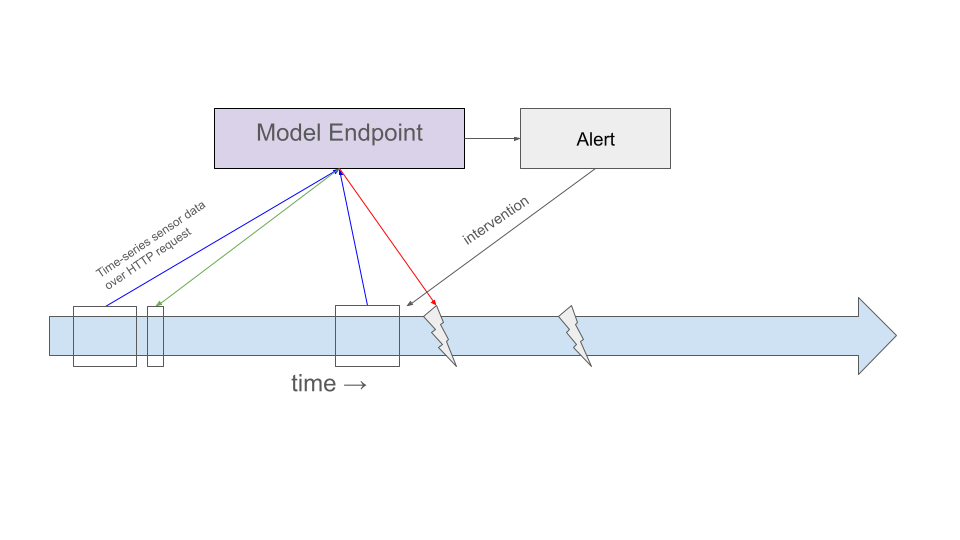

## Problem Statement

- Machine at Customer A has broken down **1600 times**
- Experts have manually labelled **40** of these into **3 failure categories**
- **Goal:** use the 40 labels to classify all 1560 unlabelled breakdowns

. . .

**Why does this matter?**

- Saves manual labelling time
- Enables real-time breakdown classification → faster resolution
- Uncovers patterns to prevent future breakdowns

## Analysis & Solution
 
[View full analysis notebook →](analysis.html)


## Deployment & Value

Model packaged as an **OutageClusterer** class with a sklearn-style interface:

```python
clusterer = OutageClusterer()
clusterer.fit_predict(data)   # train on labelled + unlabelled data
clusterer.predict(new_data)   # classify new breakdowns
clusterer.save("model.pkl")   # persist to disk
```

Served via a **FastAPI** endpoint — breakdown event sends sensor readings, endpoint returns the predicted failure category.

## Deployment & Value

Outage classifiaction setup

  - Breakdown triggers and event that sends current sensor status to model 

  - Model endpoint that receives sensor data from event triggered on breakdown

  - Returns predicted outage category, which can be handled to resolve quicker  


## Deployment & Value Extended

More value could be provided to Customer A by building a forward looking model on sensor timeseries data as they could intervene **before** the outage happens.



Outage forecasting setup

  - With small time intervals constantly sending sensor timeseries to model

  - Model endpoint that receives sensor data and predicts outage + type

  - Model sends out alerts that allow for manual intervention 


## Roadmap

*To be filled in*
