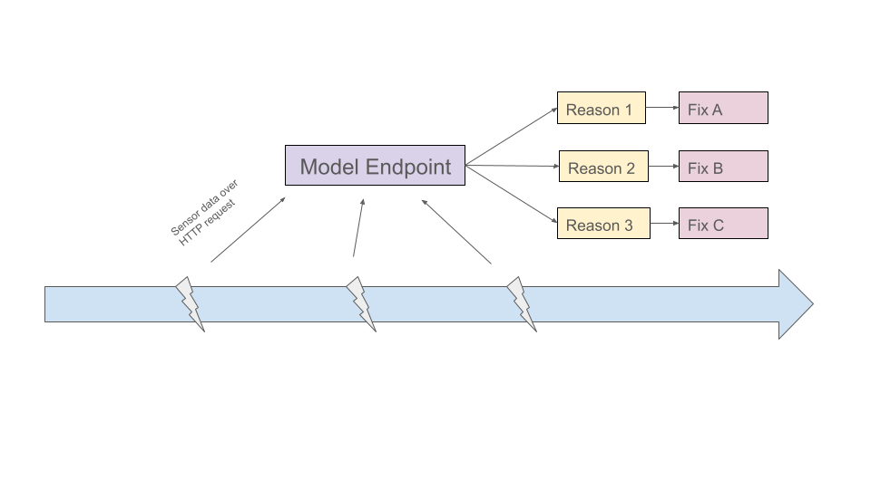
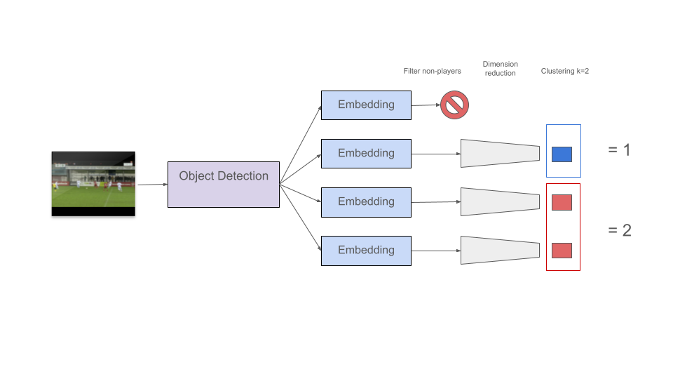
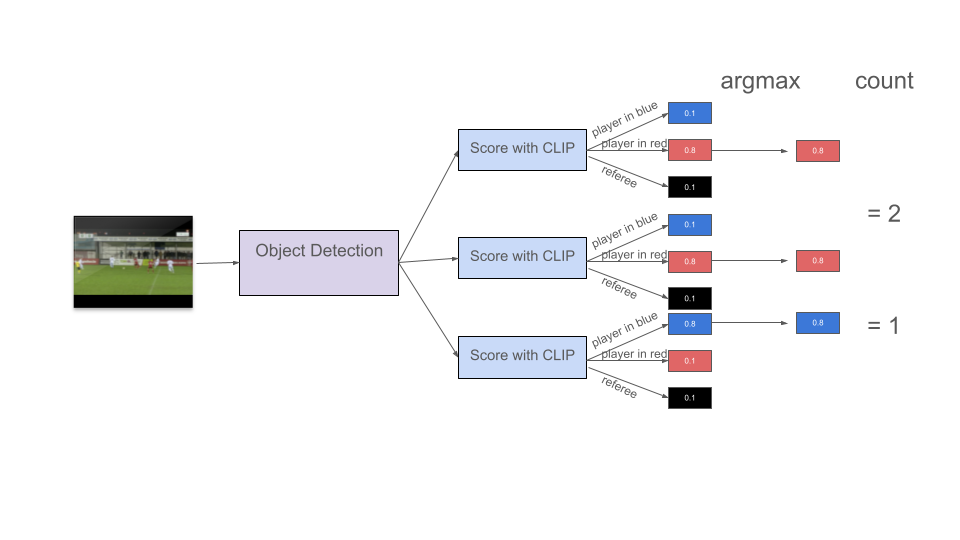

## Problem Statement

- Machine at Customer A has broken down **1600 times**
- Experts have manually labelled **40** of these into **3 failure categories**
- **Goal:** use the 40 labels to classify all 1560 unlabelled breakdowns

. . .

**Why does this matter?**

- Saves manual labelling time
- Enables real-time breakdown classification → faster resolution
- Uncovers patterns to prevent future breakdowns

## Analysis & Solution
 
[View full analysis notebook →](clustering_sensors/site/analysis.html)


## Deployment

- Model packaged as an **OutageClusterer** class with a sklearn-style interface ([source](https://github.com/wissebarkhof/ml6/blob/main/clustering_sensors/src/model.py)): 

```python
clusterer = OutageClusterer()
clusterer.fit_predict(data)   # train on labelled + unlabelled data
clusterer.predict(new_data)   # classify new breakdowns
clusterer.save("model.pkl")   # persist to disk
```


- Served via a **FastAPI** endpoint — breakdown event sends sensor readings, endpoint returns the predicted failure category.

. . . 

- On Google Cloud this can be containerised and deployed to Cloud Run, which scales to 0 if not used.

. . .

**Prerequisites before deployment**

1. **Label more data** — currently we only evaluate on training data. For validating this logic as a classifier, 100 more labels would be needed. 
2. **Consider a non-linear classifier** on the full labelled set as a more robust solution

## Deployment Architecture

Outage classification setup

  - Breakdown triggers and **event that sends current sensor status** to model 

  - Model **endpoint** that receives sensor data from event triggered on breakdown

  - Returns predicted **outage category**, which can be handled to **resolve the problem quicker** by sending alerts to the dedicated experts. 


{fig-align="center" width="80%"}

## Value Extended

More value could be provided to Customer A by building a forward looking model on sensor timeseries data as they could intervene **before** the outage happens.

{fig-align="center" width="80%"}

Outage forecasting setup

  - With **small time intervals**, sending sensor timeseries to model

  - Model endpoint that receives sensor data and predicts **outage + type**

  - Model sends out alerts that allow for manual **intervention and prevention** 


## Roadmap {.smaller}

::: {style="font-size: 0.55em"}

_Simple_

| Week | Objective | Client input | Risk |
|------|-----------|--------------|------|
| 1 | Feasibility study & model development (done) | Provide labelled data (done) | Low |
| 2 | Validate classifier on additional labelled data | Label 100 more breakdowns | Medium (delay) |
| 3–4 | Build & test deployment pipeline | Access to infrastructure | Medium |
| 5 | Model monitoring & alerting setup | - | Low |

_Extended_

| Week | Objective | Client input | Risk |
|------|-----------|--------------|------|
| — | *Dependency: historical timeseries data available* | **Provide timeseries export** | High |
| 6 | Build timeseries classifier | — | High |
| 7–8 | Deploy timeseries classifier | Access to infrastructure | Medium |
| 9 | Monitoring & alerting for timeseries model | Define intervention thresholds | Low |

*Weeks 1–5 (Junior Engineer) run in parallel with weeks 6–9 (Senior Engineer) once the data dependency is resolved.*

:::

# Use Case 2 — Sports Analytics

## Problem Statement

- Customer B has gathered **video data of soccer games**
- Goal: determine **how many players per team** are visible on screen at any given time

. . .
 
**Why does this matter?**

- Combined with position on the field this can guide offensive or defensive actions and **calculate further statistics for trainers**
- Assistance to **commentators in real-time**  

. . . 

I will present some approaches that we can weigh

## Self-hosted approach 1&2 
### Prelimenary: detection

Both approaches start with detecting all people in each frame:

- **Detectron2** (Meta) — Apache 2.0, free for commercial use
- **YOLO** (Ultralytics) — AGPL-3.0, requires enterprise license for commercial use 
    - _Pro:_ has a pretrained football model

Outputs: one bounding box per person per frame

## Approach 1: Unsupervised  [(inspiration)](https://github.com/roboflow/sports/blob/main/sports/common/team.py)

1. **Embed** each player crop using an image model
   - CLIP (OpenAI) or SigLIP (Google)
2. **Filter** referees & non-players
3. **Dimensionality reduction** — UMAP 
4. **Cluster** — K-Means (n=2)
5. **Count** per cluster per frame

{fig-align="center" width="80%"}

## Approach 1: Unsupervised  [(inspiration)](https://github.com/roboflow/sports/blob/main/sports/common/team.py)

1. **Embed** each player crop using an image model
   - CLIP (OpenAI) or SigLIP (Google)
2. **Filter** referees & non-players
3. **Dimensionality reduction** — UMAP
4. **Cluster** — K-Means (n=2)
5. **Count** per cluster per frame

**Pros:**

- No need for generating labels

**Cons:**

- Might be imprecise

- Filter non-playes non-trivial  (YOLO might help here)

- Need to host 2 models (object detection + embedding)

## Approach 2: Zero-shot with CLIP

1. **Score** each player crop against text labels using CLIP
   - Examples: `"player in red"`, `"player in white"`, `"referee"`
2. **Assign** the label with the highest score
3. **Count** per label per frame

{fig-align="center" width="80%"}

## Approach 2: Zero-shot with CLIP

1. **Score** each player crop against text labels using CLIP
   - Examples: `"player in red"`, `"player in white"`, `"referee"`
2. **Assign** the label with the highest score
3. **Count** per label per frame

**Pros:**

- Might be more precise than unsupervised
- Scales to other use cases more easily

**Cons:**

- Generating text-labels non-trivial
- Need to host 2 models (object detection + classifcation)

## Approach 3: Managed Vision APIs

- Several managed APIs exist (Google Video Intelligence, AWS Rekognition, Azure Video Indexer, Roboflow) 
- Selection depends on client infrastructure preferences and quality vs cost benchmarking

**Pros:**

- Easy to implement and prototype
- Cheaper for small volumes

**Cons:**

- Propieritary data leaves your company 
- Expensive for large volumes
- Vendor lock-in 


## Approach Comparison {.smaller}

| | Unsupervised | Zero-shot | Managed API |
|---|---|---|---|---|
| **Precision** | Lower | Higher  | High |
| **Text labels needed** | No | Yes | No |
| **Models to host** | 2 | 2 | 0 |
| **License** | Apache 2.0/AGPL-3.0 | Apache 2.0/AGPL-3.0 | Proprietary |
| **Data leaves premises** | No | No | Yes |
| **Cost at scale** | Low | Low | High |
| **Implementation effort** | High | High | Low |

## Deployment

In order to determine the deployment of these approaches, we need to know:

- **Batch vs Real-time**: 
  - For **batch** predictions that we can run at request or scheduled, latency is less of an issue. GPU preemptible. 
  - For **real-time inference** we need to build for speed. Managed APIs are probably not an option due to network delays. Live GPU instance.

- **Low or high-volume**: 
  - **Low volumes** could be cheaper through a managed API.
  - High volumes are better self-hosted as the cost scales better.

. . . 

**Note:** The managed API approach has a hard requirement of data leaving the premise.

## Deployment for self-hosted batch processing

- **Scheduled job** that polls every (6, 12, 24) hours for new videos uploaded
- **Spin up single GPU** (like T4) should be enough to run both models (sequentially)
- **Timestamped predictions** uploaded to data warehouse for further processing

## Deployment for self-hosted real-time processing

- **Endpoint** for model inference on a video stream
- **Constant live GPU** (like T4) to run both models
- **Live predictions** stream

## Roadmap {.smaller}

Our recommended road-map is to 
- Prototype with managed Vision APIs (MVP)
- Build out own solution if proven value

::: {style="font-size: 0.55em"}

| Week | Objective | Client input | Risk |
|------|-----------|--------------|------|
| 1 | Ideation + requirement collection (done) | Requirements | Low |
| 2 & 3 | Managed API protyping | Quality assessment | Low |
| 4 - 6 | Develop self-hosted model | Labelled validation data | High |
| 7 & 8 | Deploy self-hosted approach  | Infrastructure access | Medium |

:::

## Open Questions Sports Analytics

1. How much data have they collected? Is it annotated?
2. What is the resolution of inference. 
- "At any given time" is constant/streaming
- Does it need to be real-time?
3. Is all the data from the same camera/field/position or is it wildly different?

# Appendix

Timeseries outage prediction
1. Collect timeseries sensor data before these 1600 outages + ~1600 points in well operating times.
    - Length depends on the resolution and structure of the data
    - Label will be wether an outage occured in predetermined window that leaves customer with ample time to respond.

2. Extract features like lagged values, seasonal patterns, trends.

3. Train a non-linear classifier like gradient boosting tree to classify outage vs non-outage.

